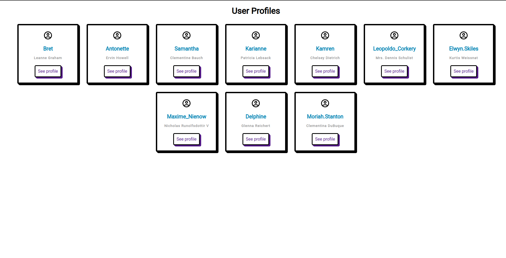
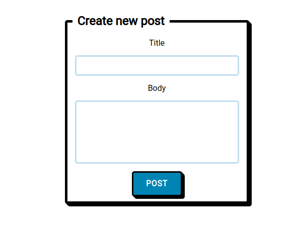
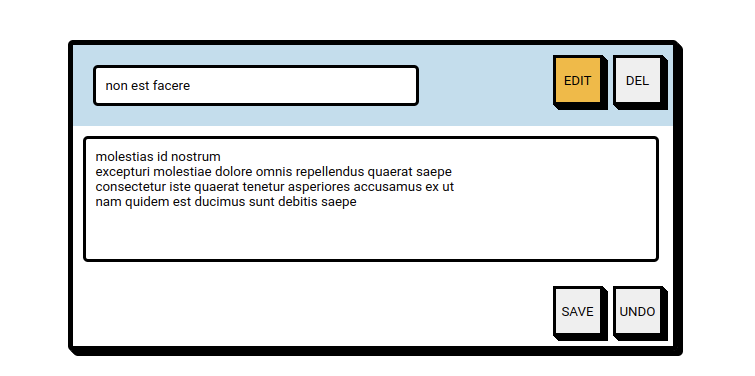

# Fetch API Quiz 2021-2022 Class of October 2021 Junior Front-End Developer

My solution for the Fetch API quiz.

LIVE : https://qbreek.github.io/fetch-study/

## 1. Fetch the users

Instead of loging only the first 5 in the console I present all the users into the view.

```javascript
async function displayUsers(url) {
  try {
    const response = await fetch(url);
    if (!response.ok) {
      throw new Error(`HTTP error: ${response.status}`);
    }

    console.log(response);
    const users = await response.json();
    users.forEach((user) => {
      createUserProfileCardElement(user);
    });
  } catch (error) {
    console.error(`Could not get users: ${error}`);
  }
}
```

    See modules/displayUsers.js starting at line 2.



## 2. Post a post

Click on any See Profile anchor in the User Profiles view. This will redirect you to the individual user profile.

To post a new post fill out the Title and Body fields and click POST.



```javascript
async function createPost(postObject) {
  const settings = {
    method: "POST",
    body: JSON.stringify(postObject),
    headers: {
      "Content-type": "application/json; charset=UTF-8",
    },
  };

  try {
    const response = await fetch(
      "https://jsonplaceholder.typicode.com/posts",
      settings
    );

    if (!response.ok) {
      throw new Error(`HTTP error: ${response.status}`);
    }

    console.log(response);
    const json = await response.json();
    console.log(json);

    const postHistoryView = document.querySelector(".post-history-list");
    const postCardElement = createPostElementCard(postObject);
    postHistoryView.prepend(postCardElement);
  } catch (error) {
    console.error(`Couldn't create new post: ${error}`);
  }
}
```

    See modules/formSubmitButtonLogic.js starting at line 4.

## 3. Update a post

Click on the edit button of a singular post card.



If changes on either the posts title or body are made the specific post is updated when the user presses SAVE.

```javascript
// Pseudo PATCH method
async function updatePost(updateObject, postId) {
  const settings = {
    method: "PATCH",
    body: JSON.stringify(updateObject),
    headers: { "Content-type": "application/json; charset=UTF-8" },
  };

  try {
    const response = await fetch(
      `https://jsonplaceholder.typicode.com/posts/${postId}`,
      settings
    );

    if (!response.ok) {
      throw new Error(`HTTP error: ${response.status}`);
    }

    console.log(response);
    const json = await response.json();
    console.log(json);
  } catch (error) {
    console.error(`Couldn't update post: ${error}`);
  }
}
```

    See modules/CreatePostElementCard.js starting at line 120.

## 4. Delete a post

Clicking the DEL button will perform a pseudo DELETE method.

```javascript
// Pseudo DELETE method
async function deletePost(postId, postItemCard) {
  try {
    const response = await fetch(
      `https://jsonplaceholder.typicode.com/posts/${postId}`,
      { method: "DELETE" }
    );

    if (!response.ok) {
      throw new Error(`HTTP error: ${response.status}`);
    }

    console.log(response);
    document.querySelector(".post-history-list").removeChild(postItemCard);
  } catch (error) {
    console.error(`Couldn't delete  post: ${error}`);
  }
}
```

    See modules/CreatePostElementCard.js starting at line 147.
